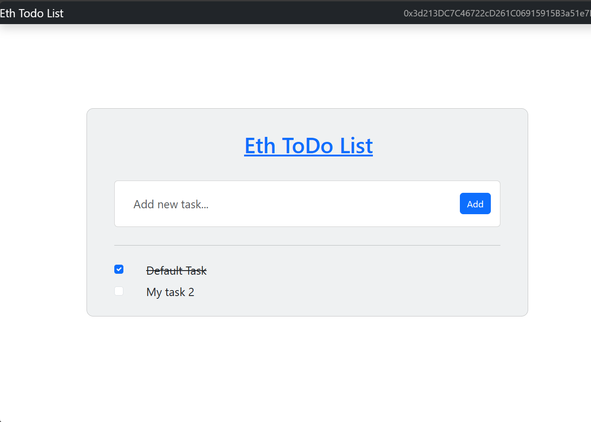
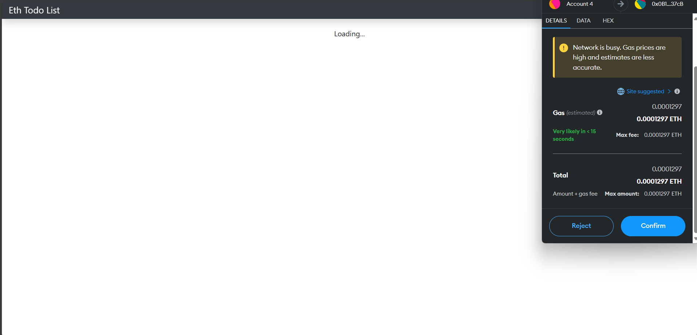

# eth-todo-list

ToDo app using eth bockchain

## Steps to run

Start local blockchain

- `ganache`

In terminal -

- `truffle migrate` - Deploy contract on blockchain
- `npm run dev` - Start client app

## Stack

- solidity
- web3
- ganache
- truffle
- chai

## UI

